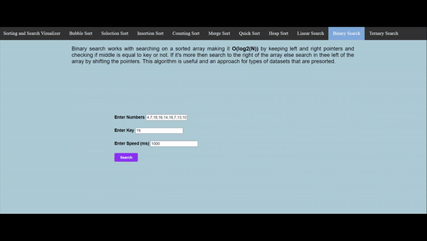

# Sort and Search Visualizer

Visualized all sort and search algorithms using the above tech stack.

***(Note: While entering input please use ',' as a separator for each value and the code supports integers only)***

| Algorithm     | Time Complexity| Space Complexity |
| :------------ |:---------------:|:-----:|
| Bubble Sort   | O(N^2)          |   O(1) |
| Selection Sort| O(N^2)          |   O(1) |
| Insertion Sort| O(N^2)          |    O(1) |
| Counting Sort | O(N)            |    O(Max_Range) |
| Merge Sort    | O(N*log2(N))    |    O(N) |
| Quick Sort    | Avg O(N*log2(N))|    O(N) |
| Heap Sort     | O(N*log2(N))    |    O(N) |
| Linear Search | O(N)            |    O(1) |
| Binary Search | O(log2(N))      |    O(1) |
| Ternary Search| O(log3(N))      |    O(1) |

## Sorting Algorithms

### Bubble Sort

- - - -
### Selection Sort

- - - -
### Insertion Sort

- - - -
### Counting Sort

- - - -
### Merge Sort

- - - -
### Quick Sort

- - - -
### Heap Sort

## Search Algorithms

### Linear Search

- - - -
### Binary Search

- - - -
### Ternary Search

- - - -
